# Spending Your Resources

<figure markdown="span">
  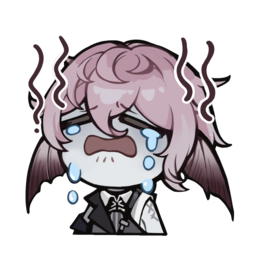{width="128"} <figcaption>Caecus wasted all his Rose Scrip and is now broke. Don't be like Caecus.</figcaption>
</figure>

## Your First Awakening

After completing the prologue, you get a free 5-pull where you can choose any SSR awakener from the standard banner. Here are the options:

<ul class="gallery" markdown="block">
  <li markdown="span" style="background-color: var(--md-realms-chaos)">
    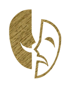{width="96"}
    
Chaos

  </li>
  <li markdown="span">
    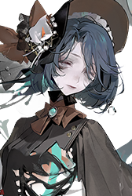{width="96"}
    
Nymphaea

  </li>
  <li markdown="span">
    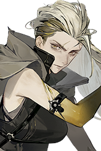{width="96"}
    
Alva

  </li>
  <li markdown="span">
    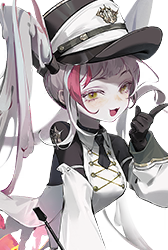{width="96"}
    
Pandia

  </li>
  <li markdown="span">
    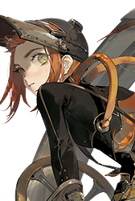{width="96"}
    
Nautila

  </li>
  <li markdown="span">
    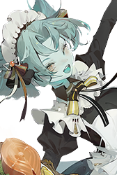{width="96"}
    
Karen

  </li>
</ul>

<ul class="gallery" markdown="block">
  <li markdown="span" style="background-color: var(--md-realms-aequor)">
    {width="96" loading="lazy"}
    
Aequor

  </li>
  <li markdown="span">
    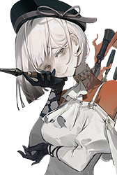{width="96" loading="lazy"}
    
Sanga

  </li>
  <li markdown="span">
    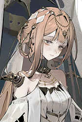{width="96" loading="lazy"}
    
Celeste

  </li>
  <li markdown="span">
    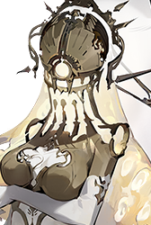{width="96" loading="lazy"}
    
Faros

  </li>
  <li markdown="span">
    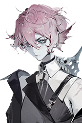{width="96" loading="lazy"}
    
Caecus

  </li>
  <li markdown="span">
    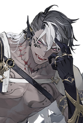{width="96" loading="lazy"}
    
Goliath

  </li>
</ul>

<ul class="gallery" markdown="block">
  <li markdown="span" style="background-color: var(--md-realms-caro)">
    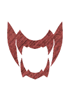{width="96" loading="lazy"}
    
Caro

  </li>
  <li markdown="span">
    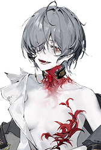{width="96" loading="lazy"}
    
Leigh

  </li>
  <li markdown="span">
    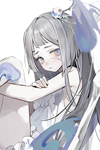{width="96" loading="lazy"}
    
Faint

  </li>
  <li markdown="span">
    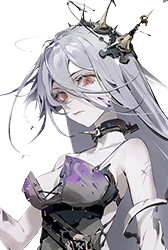{width="96" loading="lazy"}
    
Helot

  </li>
  <li markdown="span">
    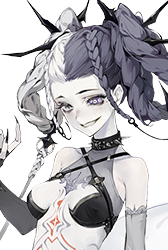{width="96" loading="lazy"}
    
Agrippa

  </li>
  <li markdown="span">
    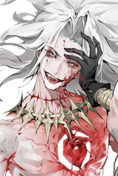{width="96" loading="lazy"}
    
Uvhash

  </li>
</ul>

<ul class="gallery" markdown="block">
  <li markdown="span" style="background-color: var(--md-realms-ultra)">
    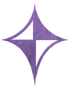{width="96" loading="lazy"}
    
Ultra

  </li>
  <li markdown="span">
    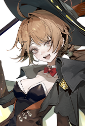{width="96" loading="lazy"}
    
Casiah

  </li>
  <li markdown="span">
    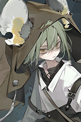{width="96" loading="lazy"}
    
Jenkin

  </li>
  <li markdown="span">
    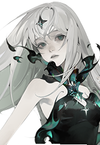{width="96" loading="lazy"}
    
Liz

  </li>
  <li markdown="span">
    {width="96" loading="lazy"}
    
Tinct

  </li>
  <li markdown="span">
    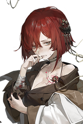{width="96" loading="lazy"}
    
Winkle

  </li>
</ul>

My advice: **Pick whoever you think is cool.**

You get standard pulls like water in this game, and you get standard characters when you miss on a limited banner, so you are going to own all of these characters eventually.

All the standard characters are equally good and usable in some way, from early game all the way to endgame. (The only exceptions are Pandia and Uvhash, who are still usable at endgame, just not as good as the others.)

You will probably have more fun doing the story mode with a character you like, rather than a character who is 5% stronger but you don't care much about.

If you *only* care about meta, go to the [official Discord](https://discord.gg/RAegY8wcGx) and ask what standard characters work best with the current rate-up limited characters.

## Should I Reroll My Account?

  **No, rerolling is a waste of time.**

  Keeper level (account level) is the most valuable stat in this game. Everything else can be fixed with patience or money, but there's no way to get a high keeper level other than sticking to one account for a long time.

  Unless you spend 500K silver pulling wheels you don't use, or something similarly ridiculous, it is very difficult to brick your account. You don't need meta characters to clear normal story mode or even get all rewards from D-Effect Zone.

  Even if you want meta characters, Morimens is one of the most generous gacha games in existence. Just wait for the developers to give you free pulls, and then you can go pull on whatever banner you want.

<figure markdown="span">
  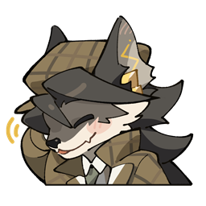{width="128" loading=lazy} <figcaption>"99% of gamblers quit before they hit the jackpot."</figcaption>
</figure>
