# Spending Your Resources

<figure markdown="span">
  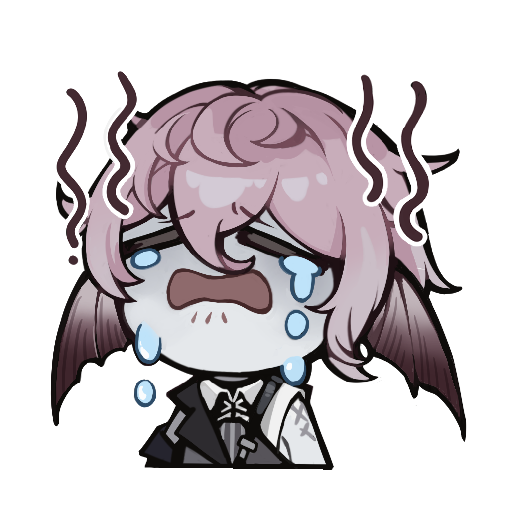{width="128"} <figcaption>Caecus wasted all his Rose Scrip and is now broke. Don't be like Caecus.</figcaption>
</figure>

## Your First Awakening

After completing the prologue, you get a free 5-pull where you can choose any SSR awakener from the standard banner. Here are the options:

<ul class="gallery" markdown="block">
  <li markdown="span" style="background-color: var(--md-realms-chaos)">
    {width="96"}
    
Chaos

  </li>
  <li markdown="span">
    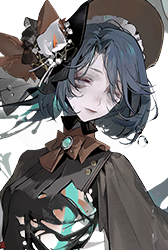{width="96"}
    
Nymphaea

  </li>
  <li markdown="span">
    {width="96"}
    
Alva

  </li>
  <li markdown="span">
    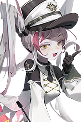{width="96"}
    
Pandia

  </li>
  <li markdown="span">
    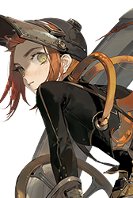{width="96"}
    
Nautila

  </li>
  <li markdown="span">
    {width="96"}
    
Karen

  </li>
</ul>

<ul class="gallery" markdown="block">
  <li markdown="span" style="background-color: var(--md-realms-aequor)">
    {width="96" loading="lazy"}
    
Aequor

  </li>
  <li markdown="span">
    {width="96" loading="lazy"}
    
Sanga

  </li>
  <li markdown="span">
    {width="96" loading="lazy"}
    
Celeste

  </li>
  <li markdown="span">
    {width="96" loading="lazy"}
    
Faros

  </li>
  <li markdown="span">
    {width="96" loading="lazy"}
    
Caecus

  </li>
  <li markdown="span">
    {width="96" loading="lazy"}
    
Goliath

  </li>
</ul>

<ul class="gallery" markdown="block">
  <li markdown="span" style="background-color: var(--md-realms-caro)">
    {width="96" loading="lazy"}
    
Caro

  </li>
  <li markdown="span">
    {width="96" loading="lazy"}
    
Leigh

  </li>
  <li markdown="span">
    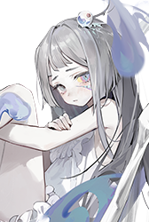{width="96" loading="lazy"}
    
Faint

  </li>
  <li markdown="span">
    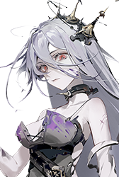{width="96" loading="lazy"}
    
Helot

  </li>
  <li markdown="span">
    {width="96" loading="lazy"}
    
Agrippa

  </li>
  <li markdown="span">
    {width="96" loading="lazy"}
    
Uvhash

  </li>
</ul>

<ul class="gallery" markdown="block">
  <li markdown="span" style="background-color: var(--md-realms-ultra)">
    {width="96" loading="lazy"}
    
Ultra

  </li>
  <li markdown="span">
    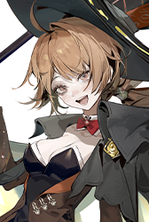{width="96" loading="lazy"}
    
Casiah

  </li>
  <li markdown="span">
    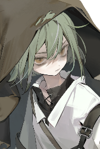{width="96" loading="lazy"}
    
Jenkin

  </li>
  <li markdown="span">
    {width="96" loading="lazy"}
    
Liz

  </li>
  <li markdown="span">
    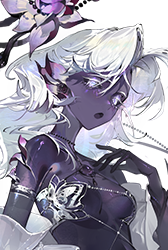{width="96" loading="lazy"}
    
Tinct

  </li>
  <li markdown="span">
    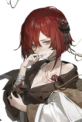{width="96" loading="lazy"}
    
Winkle

  </li>
</ul>

My advice: **Pick whoever you think is cool.**

You get standard pulls like water in this game, and you get standard characters when you miss on a limited banner, so you are going to own all of these characters eventually.

All the standard characters are equally good and usable in some way, from early game all the way to endgame. (The only exceptions are Pandia and Uvhash, who are still usable at endgame, just not as good as the others.)

You will probably have more fun doing the story mode with a character you like, rather than a character who is 5% stronger but you don't care much about.

If you *only* care about meta, go to the [official Discord](https://discord.gg/RAegY8wcGx) and ask what standard characters work best with the current rate-up limited characters.

## Should I Reroll My Account?

**No, rerolling is a waste of time.**

Keeper level (account level) is the most valuable stat in this game. Everything else can be fixed with patience or money, but there's no way to get a high keeper level other than sticking to one account for a long time.

Unless you spend 500K silver pulling wheels you don't use, or something similarly ridiculous, it is very difficult to brick your account. You don't need meta characters to clear normal story mode or even get all rewards from D-Effect Zone.

Even if you want meta characters, Morimens is one of the most generous gacha games in existence. Just wait for the developers to give you free pulls, and then you can go pull on whatever banner you want.

<figure markdown="span">
  {width="128" loading=lazy} <figcaption>"99% of gamblers quit before they hit the jackpot."</figcaption>
</figure>

## What Banner Should I Pull?

### Luminous and Ethereal Cores (Limited Pulls)

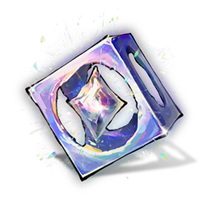{width="128" loading=lazy}
{width="128" loading=lazy}

{width="384" loading=lazy}

**Use Silver to buy Luminous Cores. Spend Luminous Cores and Ethereal Cores to pull for limited characters.**

In general, limited characters are more flexible and powerful than standard characters. As a new player with a fresh account, the fastest way to clear harder stages and get more rewards is to pick one or more of the currently running limited characters to focus on.

**You can skip limited Wheels of Destiny if you need to save pulls.** This is because characters don't need their own wheel to function. You can substitute with standard SSR wheels, or even lower-rarity wheels, and it will be enough to clear all content in the game. Sometimes the substitute is more powerful than the character's own wheel.

This guide includes Awakener Tier Lists and an SSR Wheel Tier List. The higher tier an awakener or wheel is, the more recommended it is for new players to pull for.

{width="384" loading=lazy}

The Moonless Guide banner lets you select 4 limited characters from the first year of Morimens. To summarize this guide's Awakener Tier Lists:

- Thais and Horla are very powerful and highly recommended for new players.
- Lily, Ryker, Tawil, Miryam, Murphy, GHelot, and Salvador are strong choices.
- "24", Hameln, and Tulu are okay but not amazing choices.
- Sorel, Daffodil, and Wanda aren't worth it for new players unless you really like them.

Once you hit a recommended stopping point for any of the selected characters, this banner is no longer worth pulling on because of the risk of getting useless dupes, and you should spend your pulls on the dedicated rate-up banners instead.

### Pure Cores (Standard Pulls)

{width="128" loading=lazy}

{width="384" loading=lazy}

**Use your Pure Cores to pull for all the realms in Realms Research and get lots of characters to build teams with.**

You need at least 2 characters from each realm to complete Lightless Realm and event achievements. You also need 5 teams if you don't want to miss seasonal rewards from D-Effect Zone (for a total of 19 characters + 1 borrowed support). You don't need strong teams to clear the lowest difficulty — you just need enough characters.

Morimens is a deckbuilding game. All the standard characters in this game are useful in some way. If you have problems clearing a stage, the solution is often to change your team comp. You can't do this if you have no characters.

**Aim for characters that work well with the limited character(s) you pulled for.** The Awakener Guides section has an overview of what each character does and what teammates they might want.

**Don't focus on enlightens for standard characters as a new player.** If you have problems clearing normal story stages, learning the boss mechanics and having other characters to swap in is much more important than having E2 Goliath or E3 Caecus.

!!! info ""
    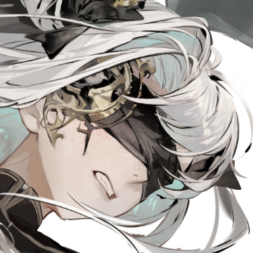{width="88.4833" loading=lazy}
    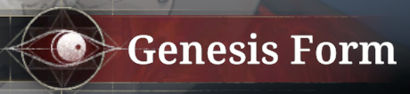{width="384" loading=lazy}

    Ramona: Timeworn (GRamona) is an alternate form of Ramona with different abilities. If you want her, she costs 60 Pure Cores to unlock. You also need to unlock and complete her Psyche Deepdive side story, "One Step Away."

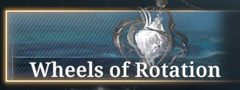{width="384" loading=lazy}

**If you have enough characters, you can pull for wheels in Wheels of Rotation.** The Awakener Guides section has suggested SSR wheels for each character. The SSR Wheel Tier List tells you which wheels are generally useful in many teams. Start by getting E3 of every wheel you plan to use in your main team.

**If you already did all of the above and don't know what to pull next**, you can:

- Get any standard character enlightens you are missing.
- Unlock Gnostic Potential for your standard characters.
- Pull on the standard character banner to fish for limited characters and +12 standards.
- Go to "wheel jail" and try to +12 a wheel. You can equip two SSR wheels at once if one of them is at +12. Blade of the Titan (Goliath's SSR wheel) is a good candidate to +12.

## Spending Menophin (Stamina)

### Events

<figure markdown="span">
  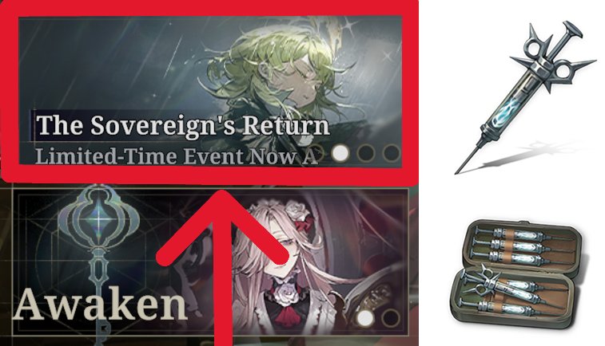{width="400" loading=lazy}
</figure>

**Spend your menophin on limited-time events.** There is usually an ongoing event with stages that cost menophin to challenge. Once you do the achievements and get the SR wheel from the event, the rewards are the same as interludes or better. If you own the associated limited character or their SSR wheel, you get even more bonus rewards.

**After fully unlocking the event, don't be afraid to use Special Potion Supply** *(stamina refills)*. As a new player, getting keeper level XP and level up materials *right now* is probably more worthwhile than whatever you are saving for in the future.

**You can do the highest difficulty and get maximum rewards.** Unlike interludes, events are not gated by keeper level. The highest difficulties can easily be beaten by borrowing a level 90 Mouchette from the leaderboards (See [How to clear event lvl 60 stages at lvl 1](https://www.reddit.com/r/Morimens/comments/1shmgbs/how_to_clear_event_lvl_60_stages_at_level_1/?utm_source=share&utm_medium=web3x&utm_name=web3xcss&utm_term=1&utm_content=share_button){target="_blank"}).

<figure markdown="span">
  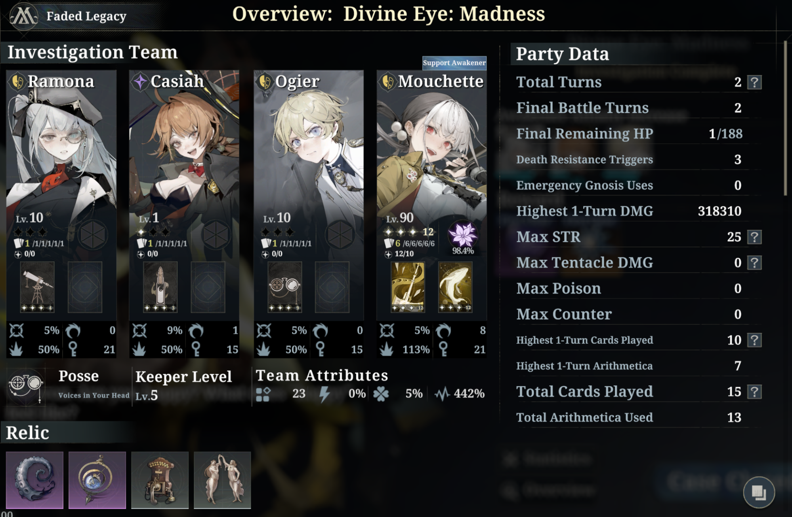{width="600" loading=lazy} <figcaption>A maxed out Mouchette easily clears Madness difficulty by herself</figcaption>
</figure>

After you clear a stage once, you can re-enact it to instantly get rewards. As a new player, it's worth it to spend a few Emergency Gnoses to clear the level 60 stages, so you get all achievements and huge value for your menophin for the next 2 weeks.

### Interludes

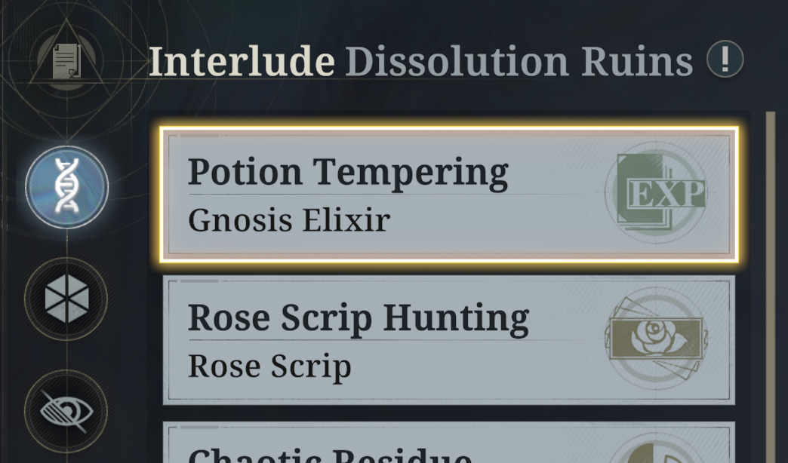{width="384" loading=lazy}

Sometimes you're unlucky and can't get a specific resource you need from events. In that case, you can farm interludes instead. Try not to do this unless you're desperate.

### Verboten Covenant

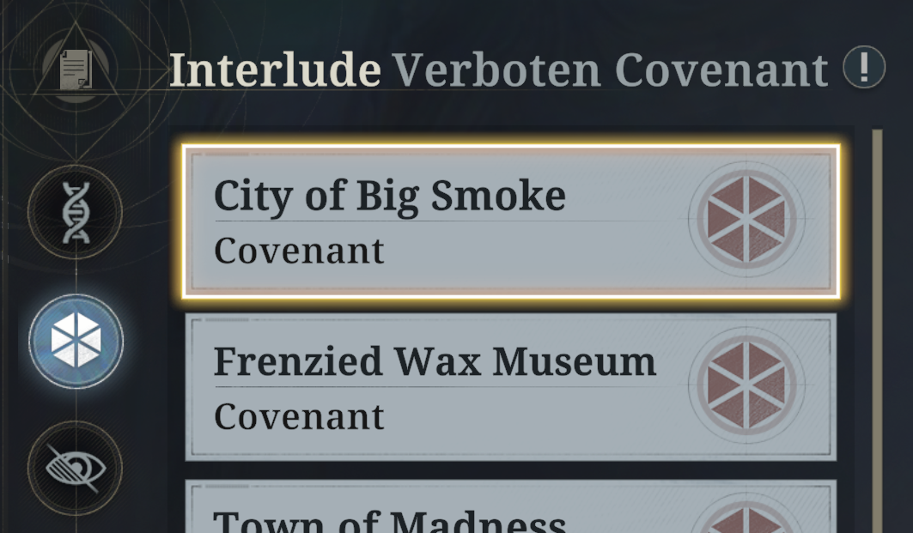{width="384" loading=lazy}

**When you unlock covenants at Keeper Level 25, spend some menophin to outfit your characters.** Event stages never give covenants. The only way to get certain covenants, like Burial Ground's Sighs or Life Drain, is to spend menophin doing Verboten Covenant interludes.

**Don't worry about substats as a new player.** Rolling for substats is incredibly expensive and best left for endgame when you have nothing else to spend Rose Scrip on. For now, focus on getting a 6-piece set for each covenant set you plan to use.

The Awakener Guides section suggests covenants for each character. The Building Covenants section suggests main stats and substats to aim for.
